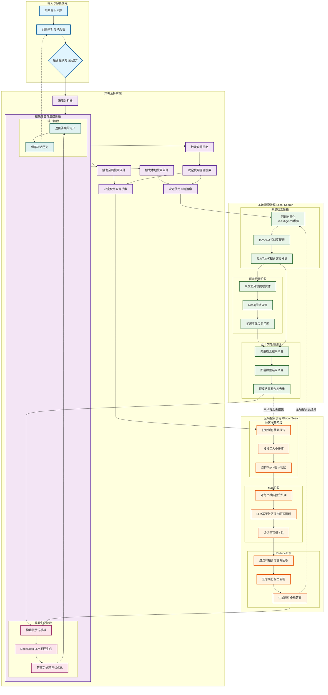

# 图检索增强生成（GraphRAG）问答流程图与解释

## 完整流程图（包含策略选择与混合搜索）



## 详细流程解释（基于完整流程图）

### 阶段一：输入与解析阶段
1. **用户输入问题** - 用户通过前端界面输入自然语言问题
2. **问题解析与预处理** - 系统对问题进行标准化处理：
   - 去除无关字符和空格
   - 转换为统一编码格式
   - 提取关键信息用于后续检索
3. **对话历史检查** - 检查是否提供了对话历史：
   - 如果有历史对话，则纳入上下文理解
   - 用于策略选择和个性化服务

### 阶段二：策略选择阶段
4. **策略分析器** - 分析问题类型和意图：
   - 提取问题特征（长度、关键词、实体数量等）
   - 结合对话历史进行上下文理解
5. **问题类型判断** - 确定最适合的搜索策略：
   - **本地搜索触发条件**：
     * 问题包含具体实体名称
     * 问题要求详细、具体的答案
     * 问题涉及特定文档内容
   - **全局搜索触发条件**：
     * 问题包含总结性词汇（"主要"、"整体"、"概括"等）
     * 问题要求宏观视角或整体理解
     * 涉及多个实体社区的关系
   - **自动策略触发**：
     * 系统自动选择最佳策略（默认）
     * 基于机器学习模型预测
     * 考虑历史查询的相似性

### 阶段三：本地搜索流程（Local Search）
**向量检索阶段：**
6. **问题向量化** - 使用BAAI/bge-m3嵌入模型将文本问题转换为高维向量
   - 模型支持多语言语义理解
   - 生成768维语义向量表示
7. **pgvector相似度搜索** - 在PostgreSQL的pgvector扩展中执行向量相似度计算
   - 使用余弦相似度或欧氏距离度量
   - 支持近似最近邻搜索（ANN）优化
8. **检索Top-K相关文档分块** - 返回最相关的K个文档片段（默认K=5）
   - 每个分块包含原始文本和元数据
   - 元数据包括文档ID、位置信息、Neo4j节点ID等

**图谱检索阶段：**
9. **从文档分块提取实体** - 从向量检索结果中识别命名实体
   - 基于预定义的实体类型（如疾病、药物、基因等）
   - 使用规则匹配或模型识别
10. **Neo4j图谱查询** - 在图数据库中查询相关实体和关系
    - 使用Cypher查询语言进行图遍历
    - 支持多跳关系和路径查询
    - 可选的文档ID过滤
11. **扩展实体关系子图** - 获取与实体相关的完整上下文
    - 包含邻居节点和关系
    - 支持深度限制的子图扩展
    - 提取实体属性和关系属性

**上下文构建阶段：**
12. **向量检索结果聚合** - 整合所有相关文档分块
    - 按相关性排序和去重
    - 提取关键文本片段
    - 保留来源信息
13. **图谱检索结果聚合** - 整合图结构信息
    - 实体节点属性信息
    - 关系类型和方向信息
    - 子图的拓扑结构
    - 社区信息（如果包含）
14. **双模结果融合与去重** - 融合两种检索模式的结果
    - 基于注意力权重的结果融合
    - 消除重复和冗余信息
    - 构建统一的上下文表示
    - 生成本地搜索结果

### 阶段四：全局搜索流程（Global Search）
**社区准备阶段：**
15. **获取所有社区报告** - 从Neo4j中读取所有社区及其LLM生成的报告
    - 社区基于Leiden算法检测
    - 每个社区包含实体集合和关系网络
    - 社区报告包含主题总结和关键实体
16. **按社区大小排序** - 根据实体数量对社区排序
    - 优先处理大社区
    - 可配置最大社区数量（默认10个）
17. **选择Top-N最大社区** - 选择前N个最大的社区进行处理
    - 支持文档ID过滤（如果指定）

**Map阶段（并行处理）：**
18. **对每个社区独立处理** - 并行处理每个选中的社区
    - 提取社区报告摘要
    - 准备社区特定上下文
19. **LLM基于社区报告回答问题** - 让LLM基于每个社区报告独立回答问题
    - 使用相同的用户问题
    - 每个社区生成独立的答案
20. **评估回答相关性** - 判断社区回答是否包含相关信息
    - 使用规则或模型评估
    - 标记相关和不相关的回答

**Reduce阶段（汇总）：**
21. **过滤有相关信息的回答** - 只保留包含相关信息的社区回答
    - 去除"不知道"或无关的回答
    - 统计相关社区数量
22. **汇总所有相关回答** - 整合所有相关社区的回答
    - 按社区重要性排序
    - 保留来源信息
23. **生成最终全局答案** - 基于汇总信息生成最终答案
    - 如果无相关社区，触发回退机制
    - 生成全局视角的总结性答案

### 阶段五：混合搜索与结果融合
24. **混合搜索策略执行** - 当选择混合搜索时：
    - 并行执行本地搜索和全局搜索
    - 分别获取两种搜索结果
25. **结果融合与去重** - 合并本地和全局搜索结果：
    - 去除冗余和重复信息
    - 保留互补内容
    - 构建统一的上下文表示
26. **回退机制** - 处理无结果或低质量结果：
    - 本地搜索无结果 → 回退到全局搜索
    - 全局搜索无结果 → 回退到本地搜索
    - 两者均无结果 → 返回友好提示

### 阶段六：答案生成阶段
27. **构建提示词模板** - 设计LLM输入模板
    ```python
    模板结构：
    - 系统指令：定义AI角色和任务
    - 检索上下文：本地/全局/混合搜索结果
    - 用户问题：原始问题
    - 对话历史：历史对话上下文（如果有）
    - 生成要求：格式、长度、风格等限制
    ```
28. **DeepSeek LLM推理生成** - 使用大语言模型生成答案
    - 基于融合的上下文进行推理
    - 支持思维链（Chain-of-Thought）推理
    - 生成自然语言答案
    - 可配置温度参数和最大token数
29. **答案后处理与格式化** - 对生成结果进行优化
    - 语法和格式检查
    - 添加引用和来源标注
    - 结构化展示（列表、表格、章节等）
    - 实体高亮和链接

### 阶段七：输出与反馈阶段
30. **返回答案给用户** - 通过前端界面展示结果
    - 答案文本显示
    - 相关实体高亮
    - 可视化图谱展示（可选）
    - 显示置信度和来源信息
31. **保存对话历史** - 记录用户交互
    - 保存用户问题和AI回答
    - 记录检索来源和策略选择
    - 更新对话上下文
    - 支持多轮对话连贯性
32. **反馈循环** - 系统学习和优化：
    - 用户反馈收集
    - 检索质量评估
    - 策略选择优化
    - 模型参数调整

## 关键技术创新

### 1. 双模检索机制
- **向量检索优势**：捕捉语义相似性，处理模糊查询
- **图谱检索优势**：捕获结构化关系，支持复杂推理
- **融合策略**：动态权重调整，自适应查询类型

### 2. 图上下文扩展
- **局部扩展**：从检索点向邻居节点扩展
- **社区发现**：识别相关实体社区
- **路径推理**：发现实体间的间接关系

### 3. 智能提示工程
- **上下文优化**：选择性包含最相关信息
- **推理引导**：引导LLM进行逻辑推理
- **格式控制**：确保答案的一致性和可读性

## 流程优化策略

### 性能优化
1. **缓存机制**：对高频查询结果进行缓存
2. **异步处理**：耗时的图谱查询异步执行
3. **批量处理**：多个查询的批量优化

### 质量优化
1. **相关性过滤**：设置相似度阈值过滤低质量结果
2. **多样性控制**：确保检索结果的覆盖广度
3. **可信度评估**：对生成答案进行可信度评分

### 可扩展性
1. **模块化设计**：各阶段可独立扩展和优化
2. **插件架构**：支持不同检索算法和模型的插拔
3. **配置驱动**：通过配置文件调整流程参数

## 典型应用场景

### 场景一：医疗诊断问答
```
用户问题："阿尔茨海默症与哪些蛋白质变异有关？"

流程执行：
1. 向量检索 → 找到相关医学文献片段
2. 图谱检索 → 查询"阿尔茨海默症"实体及关联蛋白质
3. 融合结果 → 整合文献证据和知识图谱关系
4. LLM生成 → 生成包含具体蛋白质变异的详细答案
```

### 场景二：科技文献查询
```
用户问题："量子计算在药物发现中的应用有哪些最新进展？"

流程执行：
1. 向量检索 → 找到相关研究论文摘要
2. 图谱检索 → 查询"量子计算"、"药物发现"等实体关系
3. 融合结果 → 结合文献内容和领域知识
4. LLM生成 → 总结最新研究进展和应用案例
```

### 场景三：企业知识管理
```
用户问题："公司去年在人工智能领域的投资重点是什么？"

流程执行：
1. 向量检索 → 查找相关内部文档和报告
2. 图谱检索 → 查询公司实体、投资项目关系
3. 融合结果 → 整合文档内容和组织结构信息
4. LLM生成 → 总结投资重点和战略方向
```

## 技术指标

| 指标 | 目标值 | 说明 |
|------|--------|------|
| 响应时间 | < 3秒 | 端到端处理时间 |
| 检索召回率 | > 85% | 相关文档/实体发现率 |
| 答案准确率 | > 90% | 生成答案的正确性 |
| 系统可用性 | > 99.5% | 服务稳定运行时间 |
| 并发处理 | 100+ QPS | 每秒查询处理能力 |

## 部署架构

```
前端层：Vue.js应用 → API网关层 → 后端服务层
                                    ↓
向量检索服务 → 图谱检索服务 → 融合服务 → LLM服务
      ↓              ↓            ↓          ↓
  pgvector       Neo4j         Redis     DeepSeek API
```

## 监控与维护

### 监控指标
- **性能监控**：响应时间、吞吐量、错误率
- **质量监控**：检索相关性、答案准确性
- **资源监控**：CPU、内存、数据库连接数

### 维护策略
- **定期更新**：知识图谱和向量库的增量更新
- **模型优化**：嵌入模型和LLM的版本升级
- **性能调优**：查询优化和缓存策略调整

---

*本流程图基于实际GraphRAG系统实现，反映了图检索增强生成问答的完整技术流程。*