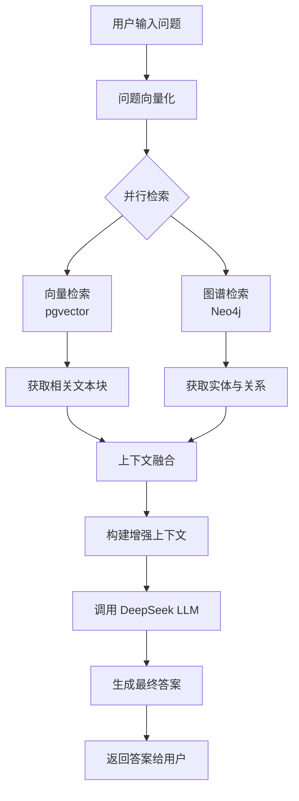

# 项目 Wiki 文档

## 1. 项目概述

### 1.1 项目简介
本项目是一个融合传统检索增强生成（RAG）与图谱检索增强生成（GraphRAG）的智能问答平台。系统结合了向量检索与知识图谱的结构化查询能力，提供多模态的知识管理与智能对话服务。后端基于 Flask 框架，前端采用 Vue.js 技术栈，支持文档上传、知识库管理、图谱构建、智能问答等功能。

### 1.2 核心功能
- **用户认证与管理**：完整的登录、注册、权限控制体系
- **知识库管理**：创建、编辑、删除知识库，支持多用户隔离
- **文档处理**：支持 PDF、Word、Excel、Markdown 等格式上传，自动进行文本提取、分块与向量化
- **传统 RAG 检索**：基于 pgvector 的向量相似度搜索，返回相关文档片段
- **知识图谱构建**：从文本中提取实体与关系，存储到 Neo4j 图数据库
- **GraphRAG 智能问答**：结合图谱的结构化信息与向量检索，回答复杂关系查询
- **聊天对话系统**：支持多轮对话、流式响应、会话历史管理
- **角色管理**：预定义 AI 角色（如“学生”、“医生”），定制对话风格
- **系统监控**：健康检查、配置查看、运行状态统计

### 1.3 应用场景
- **企业知识库**：内部文档的智能检索与问答
- **科研资料管理**：文献关联分析与知识发现
- **教育辅助**：学科知识图谱构建与智能答疑
- **医疗健康**：疾病、药物、基因等实体关系查询

### 1.4 技术亮点
- **双模检索**：向量检索与图谱检索互补，提升答案准确性与可解释性
- **模块化设计**：服务层、API 层、模型层清晰分离，便于扩展
- **异步处理**：长任务（如文档解析、图谱构建）使用后台队列，不阻塞请求
- **多数据库集成**：PostgreSQL（关系数据+向量）、Neo4j（图谱）、SQLite（开发）
- **现代化前端**：基于 Vben Admin 的响应式界面，支持暗色主题

## 2. 技术架构

### 2.1 整体架构图
```
┌─────────────────────────────────────────────────────────────┐
│                       前端 (Vue.js)                          │
│                   (vben-web 项目)                            │
└────────────────────────────┬────────────────────────────────┘
                             │ HTTP/WebSocket
┌────────────────────────────┴────────────────────────────────┐
│                       后端 (Flask)                           │
│  ┌─────────────┐  ┌─────────────┐  ┌────────────────────┐  │
│  │  认证与用户  │  │  知识库管理  │  │  聊天对话服务      │  │
│  └─────────────┘  └─────────────┘  └────────────────────┘  │
│  ┌─────────────┐  ┌─────────────┐  ┌────────────────────┐  │
│  │ 文档处理    │  │ 传统RAG检索  │  │ 知识图谱服务       │  │
│  └─────────────┘  └─────────────┘  └────────────────────┘  │
└────────────────────────────┬────────────────────────────────┘
                             │ 数据库访问
┌─────────────────┬──────────┴──────────┬─────────────────────┐
│   PostgreSQL    │        Neo4j         │     文件存储        │
│  (关系+向量)    │     (知识图谱)       │   (上传文档)        │
└─────────────────┴──────────────────────┴─────────────────────┘
```
*注：可替换为更直观的架构图图片，建议放置于 `docs/images/` 目录下。*

### 2.2 技术栈介绍
#### 后端技术栈
- **Web 框架**：Flask + Flask-SQLAlchemy + Flask-Migrate
- **数据库**：
  - PostgreSQL（主数据库，关系存储）
  - pgvector（向量检索扩展）
  - Neo4j（图数据库，存储实体与关系）
- **AI 组件**：
  - DeepSeek LLM（通过 API 调用）
  - OpenAI 兼容嵌入模型（BAAI/bge-m3）
  - LangChain / LangGraph（工作流编排）
- **任务队列**：内置线程池实现异步处理
- **身份认证**：JWT（JSON Web Token）
- **文件处理**：python-docx, pdfplumber, pandas 等

#### 前端技术栈
- **框架**：Vue 3 + TypeScript + Vite
- **UI 库**：Ant Design Vue + Vben Admin
- **状态管理**：Pinia
- **路由**：Vue Router
- **HTTP 客户端**：Axios
- **可视化**：ECharts / D3.js（图谱展示）

#### 开发与部署
- **版本控制**：Git
- **包管理**：pip (Python) / pnpm (前端)
- **容器化**：支持 Docker 部署（需自行配置）
- **环境配置**：.env 文件管理敏感信息

### 2.3 数据流说明
1. **文档上传流程**：用户上传文件 → 后端接收并存储 → 文本提取 → 分块 → 向量化 → 向量存入 pgvector → 实体关系提取 → 存入 Neo4j
2. **查询流程**：用户输入问题 → 向量检索（pgvector）→ 图谱检索（Neo4j）→ 结果融合 → LLM 生成答案 → 返回用户
3. **对话流程**：创建会话 → 用户发送消息 → 检索相关上下文 → LLM 生成回复 → 流式返回 → 保存历史记录

## 3. 项目结构

### 3.1 后端目录结构
```
项目根目录/
├── app/                           # Flask 应用核心
│   ├── api/                       # API 蓝图
│   │   ├── __init__.py            # 主蓝图定义
│   │   ├── character_api.py       # 角色管理接口
│   │   ├── chat_api.py            # 聊天对话接口
│   │   ├── kb_api.py              # 知识库管理接口
│   │   ├── knowledge_base_api.py  # 知识库接口（兼容旧版）
│   │   ├── kg_api.py              # 知识图谱接口
│   │   └── rag_api.py             # RAG 检索接口
│   ├── models/                    # 数据库模型
│   │   ├── __init__.py
│   │   ├── user.py                # 用户模型
│   │   ├── knowledge_base.py      # 知识库模型
│   │   ├── neo_document.py        # 图谱文档模型
│   │   ├── session.py             # 聊天会话模型
│   │   ├── chat.py                # 聊天消息模型
│   │   ├── character.py           # 角色模型
│   │   └── kg_mapping.py          # 图谱映射模型
│   ├── services/                  # 业务逻辑服务层
│   │   ├── auth/                  # 认证服务
│   │   ├── user/                  # 用户服务
│   │   ├── upload/                # 文件上传服务
│   │   ├── rag/                   # RAG 相关服务
│   │   │   ├── rag_up/            # 文档上传处理
│   │   │   └── rag_search/        # 向量检索
│   │   ├── neo/                   # 知识图谱服务
│   │   │   ├── graph_service.py   # 图数据库基础操作
│   │   │   ├── kg_builder.py      # 图谱构建
│   │   │   ├── kg_manager.py      # 图谱管理
│   │   │   ├── kg_query.py        # 图谱查询
│   │   │   ├── mapping_manager.py # 映射管理
│   │   │   └── graphrag_service.py # GraphRAG 核心服务
│   │   ├── async_tasks.py         # 异步任务队列
│   │   ├── doc_converter.py       # 文档格式转换
│   │   ├── doc_magene.py          # 文档解析（magene）
│   │   ├── embedding.py           # 嵌入模型服务
│   │   ├── mineru.py              # 文本提取服务
│   │   ├── rag_service.py         # RAG 服务协调
│   │   └── splitting.py           # 文本分块服务
│   ├── workflows/                 # 工作流编排
│   │   ├── langchain/             # LangChain 集成
│   │   └── langgraph/             # LangGraph 集成
│   ├── utils/                     # 工具函数
│   │   └── llm_utils.py           # LLM 调用工具
│   ├── static/                    # 静态资源（头像等）
│   ├── __init__.py                # 应用工厂
│   ├── config.py                  # 配置类
│   └── extensions.py              # 扩展初始化
├── migrations/                    # 数据库迁移脚本（Alembic）
├── api_docs/                      # API 接口文档（Markdown）
├── scripts/                       # 辅助脚本
├── test_files/                    # 测试文件
├── test_uploads/                  # 测试上传目录
├── uploads/                       # 用户上传文件存储
├── vben-web/                      # 前端项目（独立仓库）
├── .env                           # 环境变量配置
└── run.py                         # 应用启动入口
```

### 3.2 前端目录结构（vben-web）
```
vben-web/
├── apps/                          # 多应用目录
│   └── web-ele/                   # 主前端应用
│       ├── src/
│       │   ├── api/               # API 封装
│       │   ├── layouts/           # 布局组件
│       │   ├── locales/           # 国际化
│       │   ├── router/            # 路由配置
│       │   ├── store/             # 状态管理
│       │   ├── utils/             # 工具函数
│       │   └── views/             # 页面组件
│       │       ├── _core/         # 核心页面
│       │       ├── board/         # 仪表板
│       │       ├── kb/            # 知识库相关页面
│       │       └── system/        # 系统管理页面
│       └── ...
└── docs/                          # 项目文档
```

### 3.3 配置文件说明
- **.env**：全局环境变量，包含数据库连接、API 密钥、模型配置等
- **app/config.py**：Flask 应用配置类，从环境变量读取配置
- **app/extensions.py**：数据库驱动、CORS 等扩展初始化
- **migrations/alembic.ini**：数据库迁移配置

## 4. 核心模块详解

### 4.1 认证与用户管理
- **模块位置**：`app/services/auth/`, `app/services/user/`, `app/models/user.py`
- **功能描述**：处理用户注册、登录、JWT 令牌签发与验证、权限控制、用户信息管理
- **关键组件**：
  - `auth/__init__.py`：提供 `_decode_token`、`_user_dict` 等工具函数
  - `user/__init__.py`：用户相关的业务逻辑
  - `models/user.py`：用户数据库模型，包含用户名、密码哈希、角色等字段
- **依赖关系**：使用 Flask-JWT 扩展，密码采用 bcrypt 哈希存储

### 4.2 知识库管理
- **模块位置**：`app/models/knowledge_base.py`, `app/api/kb_api.py`, `app/api/knowledge_base_api.py`
- **功能描述**：允许用户创建、编辑、删除知识库，每个知识库可包含多个文档，支持多用户隔离
- **关键组件**：
  - `knowledge_base.py`：定义知识库模型，关联用户和文档
  - `kb_api.py`：提供知识库的 CRUD API 接口
- **数据关系**：知识库与用户为一对多关系，与文档为一对多关系

### 4.3 文档处理与向量化
- **模块位置**：`app/services/upload/`, `app/services/rag/rag_up/`, `app/services/doc_converter.py`, `app/services/splitting.py`, `app/services/embedding.py`
- **功能描述**：接收用户上传的文档（PDF、Word、Excel、Markdown 等），进行文本提取、分块、向量化，并存入向量数据库
- **处理流程**：
  1. 文件上传到 `uploads/kb/` 目录
  2. 调用 `doc_converter.py` 或 `doc_magene.py` 提取文本
  3. 使用 `splitting.py` 进行语义分块
  4. 通过 `embedding.py` 调用嵌入模型生成向量
  5. 向量存入 PostgreSQL 的 pgvector 扩展表中
- **关键配置**：嵌入模型使用 OpenAI 兼容的 BAAI/bge-m3，通过环境变量配置 API 密钥和基地址

### 4.4 传统 RAG 检索
- **模块位置**：`app/services/rag/rag_search/`, `app/api/rag_api.py`
- **功能描述**：基于向量相似度搜索，从已向量化的文档分块中检索与用户问题最相关的片段
- **关键组件**：
  - `pgvector_search.py`：实现 pgvector 的相似度搜索逻辑
  - `search_api.py`：提供搜索 API 的蓝图
  - `rag_api.py`：对外暴露 RAG 检索接口
- **检索流程**：用户问题 → 向量化 → 在 pgvector 中搜索 top-k 相似分块 → 返回分块内容及元数据

### 4.5 知识图谱构建与管理
- **模块位置**：`app/services/neo/`, `app/models/neo_document.py`, `app/models/kg_mapping.py`
- **功能描述**：从文本中提取实体与关系，构建知识图谱；提供图谱的增删改查、可视化、统计等功能
- **关键组件**：
  - `kg_builder.py`：从文本中提取实体关系，调用 LLM 或规则进行三元组抽取
  - `kg_manager.py`：图谱节点的 CRUD 操作
  - `kg_query.py`：执行 Cypher 查询，支持邻居查询、路径查找等
  - `graph_service.py`：Neo4j 驱动封装与连接管理
  - `mapping_manager.py`：管理结构化数据（如 Excel）到图谱节点的映射规则
- **数据存储**：图谱数据存储在 Neo4j 中，文档与节点的关联记录在 `neo_document` 表中

### 4.6 GraphRAG 智能问答
- **模块位置**：`app/services/neo/graphrag_service.py`, `app/api/kg_api.py`
- **功能描述**：结合图谱的结构化信息与向量检索，回答需要复杂关系推理的问题；支持全局图谱摘要、社区发现等高级功能
- **工作流程**：
  1. 用户问题同时进行向量检索和图谱检索
  2. 图谱检索：解析问题中的实体，在 Neo4j 中查找相关子图
  3. 结果融合：将向量检索的文本片段与图谱子图信息合并
  4. LLM 生成：将融合后的上下文发送给 DeepSeek LLM，生成最终答案

#### GraphRAG 流程图

##### 文档索引流程（知识库构建）
```
用户上传文档 → 文档解析 → 文本分块 → 并行处理
                                     ├→ 向量化 → 存储到 pgvector (PostgreSQL)
                                     └→ 实体关系抽取 (LLM) → 图谱构建 → 存储到 Neo4j
```

##### 查询流程（智能问答）
```
用户输入问题 → 问题向量化 → 并行检索
                                   ├→ 向量检索 (pgvector) → 获取相关文本块
                                   └→ 图谱检索 (Neo4j) → 获取实体与关系
                                    ↓
                            上下文融合 → 构建增强上下文 → LLM 生成答案 → 返回答案
```

##### Mermaid 流程图（支持渲染的 Markdown 查看器）



##### 核心方法说明
- **`GraphRAGService.query()`**：标准查询流程，向量检索 + 图谱检索 + LLM 生成
- **`GraphRAGService.local_search()`**：混合搜索，包含社区检测和关系展开
- **`GraphRAGService.extract_entities_relations()`**：使用 LLM 从文本中抽取实体和关系

**自动化构建**：详细的自动化构建流程（定时任务、CI/CD、监控等）请参阅 [`graphrag_flowchart.md`](doc/graphrag_flowchart.md#7-自动化构建流程) 第 7 章。

- **核心类**：`GraphRAGService` 封装了 Neo4j、pgvector、嵌入模型、LLM 的协同调用

### 4.7 聊天对话系统
- **模块位置**：`app/models/chat.py`, `app/models/session.py`, `app/models/character.py`, `app/api/chat_api.py`, `app/workflows/langchain/chat.py`
- **功能描述**：提供多轮对话管理、流式响应、历史记录保存、角色定制等功能
- **关键组件**：
  - `session.py`：对话会话模型，关联用户和知识库
  - `chat.py`：对话消息模型，存储每轮问答
  - `character.py`：AI 角色模型，定义系统提示词和对话风格
  - `chat_api.py`：提供创建会话、发送消息、获取历史等 API
  - `workflows/langchain/chat.py`：使用 LangChain 构建对话链，集成检索与生成
- **流式响应**：通过 Server-Sent Events (SSE) 实时返回 LLM 生成的文本碎片

### 4.8 异步任务处理
- **模块位置**：`app/services/async_tasks.py`
- **功能描述**：将耗时的文档解析、图谱构建等任务放入后台线程池执行，避免阻塞 HTTP 请求
- **实现机制**：使用 Python 的 `concurrent.futures.ThreadPoolExecutor` 创建任务队列，提供任务提交、状态查询接口
- **任务类型**：文档向量化、图谱增量构建、批量导入等

## 5. API 接口文档

### 5.1 认证与用户管理接口
详细接口列表参见 `api_docs/认证与用户管理接口文档.md`，主要端点包括：
- `POST /api/auth/login`：用户登录
- `POST /api/auth/register`：用户注册
- `GET /api/auth/codes`：获取权限码
- `GET /api/user/info`：获取个人信息
- `GET /api/user/list`：用户列表（管理端）

### 5.2 知识库管理接口
详细接口列表参见 `api_docs/传统RAG接口文档.md`，主要端点包括：
- `GET /api/api/kb/list`：获取知识库列表
- `POST /api/api/kb/create`：创建知识库
- `GET /api/api/kb/<kb_id>`：获取知识库详情
- `PUT /api/api/kb/<kb_id>`：更新知识库信息
- `DELETE /api/api/kb/<kb_id>`：删除知识库

### 5.3 文档上传与处理接口
- `POST /api/upload`：上传文档到指定知识库
- 支持 multipart/form-data 格式，参数：`file`, `kb_id`
- 返回文档 ID 及处理状态

### 5.4 传统 RAG 检索接口
详细接口列表参见 `api_docs/传统RAG检索 接口文档.md`，主要端点包括：
- `POST /api/rag/search`：向量检索，返回相关文档片段
- `GET /api/rag/modes`：获取支持的检索模式
- `POST /api/rag/mode`：切换全局检索模式

### 5.5 知识图谱管理接口
详细接口列表参见 `api_docs/知识图谱管理与构建接口文档.md`，主要端点包括：
- `GET /api/kg/stats`：获取图谱统计信息
- `GET /api/kg/nodes`：分页获取节点列表
- `GET /api/kg/search`：搜索节点
- `GET /api/kg/nodes/<node_id>`：获取节点详情与邻接关系
- `POST /api/kg/ingest`：文本增量入库（构建图谱）
- `GET /api/kg/visualize`：获取图谱可视化数据

### 5.6 GraphRAG 查询接口
详细接口列表参见 `api_docs/GraphRAG 接口文档.md`，主要端点包括：
- `POST /api/kg/graph_rag_qa`：图谱智能问答
- `GET /api/kg/communities`：获取社区检测列表
- `POST /api/kg/excel/import`：Excel/CSV 批量导入映射

### 5.7 聊天对话接口
详细接口列表参见 `api_docs/聊天对话与角色管理接口文档.md`，主要端点包括：
- `POST /api/api/chat/session/create`：创建对话会话
- `GET /api/api/chat/stream`：流式对话反馈 (SSE)
- `GET /api/api/chat/history/<session_id>`：获取历史消息
- `DELETE /api/api/chat/session/<session_id>`：删除会话
- `POST /api/api/chat/send`：发送单轮消息（同步）
- `GET /api/api/chat/sessions`：获取所有会话列表

### 5.8 系统运维接口
详细接口列表参见 `api_docs/系统接口文档.md`，主要端点包括：
- `GET /api/rag/debug/health`：系统健康检查
- `GET /api/rag/debug/config`：获取环境配置（Debug 模式）
- `GET /api/rag/knowledge-base/stats`：获取知识库/图谱统计

## 6. 部署与配置

### 6.1 环境要求
- **操作系统**：Linux / Windows / macOS（推荐 Linux 生产环境）
- **Python**：3.10 或以上
- **Node.js**：18.x 或以上（前端构建）
- **数据库**：
  - PostgreSQL 13+（安装 pgvector 扩展）
  - Neo4j 4.4+ 或 5.x
- **内存**：至少 4GB RAM（建议 8GB+）
- **磁盘空间**：根据文档数量而定，预留 10GB 以上

### 6.2 依赖安装
#### 后端依赖
```bash
cd /path/to/project
pip install -r requirements.txt   # 若存在 requirements.txt
```
若没有 requirements.txt，可手动安装核心包（参考 `app/__init__.py` 中的导入）：
```bash
pip install flask flask-sqlalchemy flask-migrate flask-cors neo4j python-dotenv \
            langchain langgraph openai python-docx pdfplumber pandas \
            pgvector psycopg2-bcrypt jwt
```

#### 前端依赖
```bash
cd vben-web
pnpm install   # 或 npm install
```

### 6.3 数据库配置
1. **PostgreSQL**：
   - 安装 PostgreSQL 并创建数据库（如 `postgres`）
   - 安装 pgvector 扩展：`CREATE EXTENSION vector;`
   - 创建表结构：运行 `flask db upgrade`（需先设置环境变量）

2. **Neo4j**：
   - 安装 Neo4j 社区版或企业版
   - 启动 Neo4j 服务，默认端口 7687
   - 创建用户（默认 `neo4j`）并设置密码

3. **环境变量配置**：
   - 复制 `.env.example`（若不存在，参考现有 `.env` 格式）为 `.env`
   - 修改数据库连接字符串、API 密钥等敏感信息
   - **关键环境变量说明**：
     - `DATABASE_URL`：PostgreSQL 数据库连接字符串
     - `NEO4J_URI`, `NEO4J_USERNAME`, `NEO4J_PASSWORD`：Neo4j 图数据库配置
     - `DEEPSEEK_API_KEY`, `DEEPSEEK_MODEL`, `DEEPSEEK_API_BASE`：DeepSeek LLM API 配置
     - `OPENAI_BASE_URL`, `OPENAI_API_KEY`, `OPENAI_EMBEDDING_MODEL`：OpenAI 兼容的嵌入模型配置（支持 BAAI/bge-m3 等）
     - `PG_VECTOR_TABLE`, `PG_VECTOR_ID_COLUMN` 等：pgvector 表结构配置

### 6.4 服务启动
#### 后端启动
```bash
cd /path/to/project
python run.py   # 开发模式，默认端口 5000
```
或使用生产 WSGI 服务器（如 Gunicorn）：
```bash
gunicorn -w 4 -b 0.0.0.0:5000 "app:create_app()"
```

#### 前端启动
```bash
cd vben-web/apps/web-ele
pnpm dev   # 开发模式
```
生产构建：
```bash
pnpm build
pnpm preview   # 预览生产版本
```

### 6.5 前端部署
- 将前端构建产物（`dist` 目录）部署到 Nginx 或 Apache 等静态文件服务器
- 配置反向代理，将 `/api` 等接口请求转发到后端服务
- 示例 Nginx 配置：
```nginx
server {
    listen 80;
    server_name your-domain.com;
    root /path/to/vben-web/apps/web-ele/dist;
    index index.html;
    location /api {
        proxy_pass http://localhost:5000;
        proxy_set_header Host $host;
        proxy_set_header X-Real-IP $remote_addr;
    }
    location / {
        try_files $uri $uri/ /index.html;
    }
}
```

## 7. 使用指南

### 7.1 快速开始
1. 按照第6章完成环境部署
2. 访问前端页面（如 `http://localhost:5173`）
3. 使用默认管理员账号（需先注册）登录
4. 创建知识库，上传文档
5. 在聊天界面提问，体验 RAG 与 GraphRAG 功能

### 7.2 知识库创建与文档上传
1. 进入“知识库管理”页面
2. 点击“新建知识库”，填写名称和描述
3. 在知识库详情页，点击“上传文档”，选择文件（PDF、Word、Excel 等）
4. 系统自动处理文档：提取文本、分块、向量化、图谱构建
5. 处理完成后，文档出现在知识库文档列表中

### 7.3 图谱构建与查询
1. 文档上传后，系统自动提取实体关系并存入 Neo4j
2. 进入“知识图谱”页面，查看图谱统计和可视化
3. 使用搜索框查找特定实体（如“肺癌”）
4. 点击节点查看详情及其关联关系
5. 在 GraphRAG 问答界面输入复杂关系问题，如“阿尔茨海默症与哪些蛋白质变异有关？”

### 7.4 聊天对话使用
1. 进入“聊天”页面，选择或创建对话会话
2. 选择 AI 角色（如“医生”、“学生”），可定制回答风格
3. 输入问题，系统将使用关联知识库进行检索并生成回答
4. 支持流式输出，可实时看到生成过程
5. 历史对话保存在会话中，可随时查看或删除

### 7.5 系统管理
- **用户管理**：管理员可查看、编辑、删除用户，分配角色
- **系统监控**：在“系统运维”页面查看后端组件健康状态、配置信息
- **模式切换**：可全局切换 RAG 模式（GraphRAG / 传统向量检索）

## 8. 开发指南

### 8.1 开发环境搭建
1. 克隆代码仓库
2. 创建 Python 虚拟环境：`python -m venv venv`
3. 激活虚拟环境：`venv\Scripts\activate`（Windows）或 `source venv/bin/activate`（Linux/Mac）
4. 安装后端依赖（见 6.2）
5. 安装前端依赖（见 6.2）
6. 配置本地数据库（可使用 Docker 快速启动 PostgreSQL 和 Neo4j）
7. 复制 `.env.example` 为 `.env`，填写本地配置

### 8.2 代码规范
- **Python**：遵循 PEP 8，使用 Black 格式化，类型提示（Type Hints）推荐
- **Vue**：遵循 Vben Admin 代码风格，使用 Composition API 与 `<script setup>`
- **提交信息**：采用 Conventional Commits 格式（feat、fix、docs 等）
- **分支策略**：主分支 `main`，功能分支 `feature/xxx`，修复分支 `fix/xxx`

### 8.3 模块扩展
#### 添加新的 API 端点
1. 在 `app/api/` 下新建蓝图文件（如 `new_api.py`）
2. 定义路由函数，使用 `@bp.route` 装饰器
3. 在 `app/api/__init__.py` 中导入并注册蓝图
4. 在 `app/__init__.py` 的 `create_app` 中注册蓝图（若需要独立 URL 前缀）

#### 添加新的数据库模型
1. 在 `app/models/` 下新建模型文件（如 `new_model.py`）
2. 定义 SQLAlchemy 模型类，继承 `db.Model`
3. 在 `app/models/__init__.py` 中导入模型
4. 生成迁移脚本：`flask db migrate -m "add new_model"`
5. 应用迁移：`flask db upgrade`

#### 添加新的服务
1. 在 `app/services/` 下新建服务文件（如 `new_service.py`）
2. 封装业务逻辑，提供可复用的函数或类
3. 在需要的地方导入并使用

### 8.4 测试与调试
#### 后端测试
- 使用 `scripts/test_api.py` 进行接口测试
- 使用 `scripts/debug_chat_api.py` 调试聊天接口
- 查看 Flask 日志输出（默认级别 INFO）

#### 前端测试
- 运行 `pnpm test` 执行单元测试（若配置）
- 使用浏览器开发者工具检查网络请求与响应

#### 常见问题排查
- **数据库连接失败**：检查 `.env` 配置，确保数据库服务已启动
- **Neo4j 连接超时**：确认 Neo4j 版本与驱动兼容，检查防火墙设置
- **向量检索无结果**：确认文档已成功向量化，检查 pgvector 表数据
- **LLM 调用失败**：检查 DeepSeek API 密钥是否有效，网络是否通畅

## 9. 附录

### 9.1 术语表
- **RAG (Retrieval-Augmented Generation)**：检索增强生成，结合检索与生成的语言模型应用
- **GraphRAG**：基于知识图谱的检索增强生成，利用图结构进行关系推理
- **pgvector**：PostgreSQL 的向量扩展，支持向量相似度搜索
- **Neo4j**：图数据库，用于存储实体关系数据
- **Cypher**：Neo4j 的查询语言，类似 SQL 但针对图数据
- **Embedding (嵌入)**：将文本转换为高维向量的过程，用于语义相似度计算
- **LLM (Large Language Model)**：大语言模型，如 DeepSeek、GPT 等

### 9.2 性能优化建议
- **文档分块策略**：根据文档类型调整分块大小，技术文档建议 500-1000 字符，论文建议 800-1200 字符
- **向量检索参数**：适当调整 top-k 值（默认 5），平衡召回率与响应速度
- **图谱查询优化**：对高频查询实体添加索引，限制子图查询深度（默认 3）
- **异步任务配置**：根据服务器资源调整线程池大小，建议 CPU 核心数 × 2
- **缓存策略**：对频繁查询的结果实施缓存，减轻数据库压力

### 9.3 安全建议
- **API 密钥管理**：永远不要将 API 密钥提交到代码仓库，使用环境变量管理
- **数据库访问控制**：为应用创建专用的数据库用户，限制其权限范围
- **文件上传限制**：设置文件大小限制、类型白名单，防止恶意文件上传
- **JWT 配置**：使用强密钥，设置适当的令牌有效期（建议 24 小时）
- **输入验证**：对所有用户输入进行验证和清理，防止注入攻击

### 9.4 扩展开发建议
- **自定义嵌入模型**：如需更换嵌入模型，修改 `app/services/embedding.py` 中的模型配置
- **新增文档格式**：如需支持新的文档格式，在 `app/services/doc_converter.py` 中添加相应解析器
- **图谱抽取规则**：如需定制实体关系抽取，修改 `app/services/neo/kg_builder.py` 中的抽取逻辑
- **前端页面定制**：参考 Vben Admin 文档，在 `vben-web/apps/web-ele/src/views/` 下添加新页面

### 9.5 监控与日志
- **后端日志**：Flask 默认日志级别为 INFO，可在 `app/config.py` 中调整
- **数据库监控**：定期检查 PostgreSQL 和 Neo4j 连接状态、查询性能
- **API 访问统计**：可通过日志分析工具（如 ELK 栈）分析 API 调用频率与响应时间
- **错误追踪**：集成 Sentry 或类似工具进行错误监控与告警

---
*文档最后更新：2026-02-26*
*GraphRAG 详细流程图请参阅 [`doc/graphrag_flowchart.md`](doc/graphrag_flowchart.md)*
*更多详细接口请参阅 `api_docs/` 目录下的 Markdown 文件*

