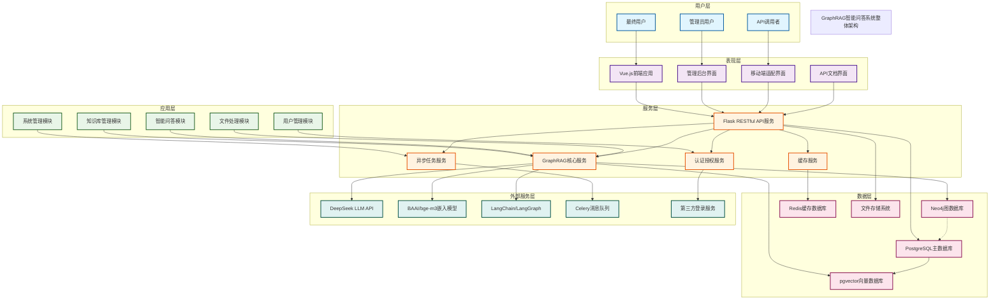

# 系统整体架构示意图

## 架构概述

本项目采用分层架构设计，结合微服务理念，实现高内聚、低耦合的系统组件。整体架构分为六层：用户层、表现层、应用层、服务层、数据层和外部服务层。各层之间通过标准化接口进行通信，确保系统的可扩展性和可维护性。

## 架构图



## 架构组件详细说明

### 1. 用户层
- **最终用户**：普通使用者，通过Web界面进行知识查询和问答
- **管理员用户**：系统管理员，负责知识库管理、用户权限配置等
- **API调用者**：第三方开发者或系统，通过API接口集成系统功能

### 2. 表现层
- **Vue.js前端应用**：基于Vue 3 + TypeScript + Vite构建的响应式Web应用
- **管理后台界面**：基于Vben Admin框架的管理控制台
- **移动端适配界面**：响应式设计，支持手机和平板访问
- **API文档界面**：基于Swagger/OpenAPI自动生成的接口文档

### 3. 应用层
- **用户管理模块**：用户注册、登录、权限控制、个人资料管理
- **知识库管理模块**：知识库创建、文档上传、版本控制、批量导入
- **智能问答模块**：问题解析、双模检索、答案生成、对话历史管理
- **系统管理模块**：系统配置、日志查看、性能监控、数据备份
- **文件处理模块**：文档格式解析、文本提取、分块处理、格式转换

### 4. 服务层
- **Flask RESTful API服务**：提供统一的RESTful API接口，处理HTTP请求
- **GraphRAG核心服务**：封装双模检索与增强生成的核心逻辑
  - 实体识别与关系抽取
  - 向量检索与图谱检索
  - 上下文融合与答案生成
- **异步任务服务**：基于线程池实现文档处理、向量化等耗时任务异步执行
- **缓存服务**：实现热点数据缓存，提升系统响应速度
- **认证授权服务**：基于JWT的身份认证和RBAC权限控制

### 5. 数据层
- **PostgreSQL主数据库**：存储用户信息、知识库元数据、系统配置等
- **pgvector向量数据库**：存储文档分块的向量表示，支持相似度搜索
- **Neo4j图数据库**：存储知识图谱的实体和关系，支持图遍历查询
- **Redis缓存数据库**：存储用户会话、热点数据、临时计算结果
- **文件存储系统**：存储上传的原始文档和生成的文件

### 6. 外部服务层
- **DeepSeek LLM API**：大语言模型服务，用于答案生成和推理
- **BAAI/bge-m3嵌入模型**：文本向量化服务，支持多语言文本嵌入
- **LangChain/LangGraph**：工作流编排框架，支持复杂任务链
- **Celery消息队列**：分布式任务队列，支持异步任务处理
- **第三方登录服务**：支持OAuth 2.0第三方账号登录

## 数据流说明

### 1. 文档上传流程
```
用户上传文档 → 表现层接收 → Flask API处理 → 文件存储系统保存 → 
异步任务处理 → 文本提取与分块 → 向量化 → pgvector存储 →
实体关系抽取 → Neo4j存储 → 完成通知用户
```

### 2. 智能问答流程
```
用户输入问题 → 前端发送请求 → Flask API接收 → JWT验证权限 →
问题向量化 → 向量检索(pgvector) → 图谱检索(Neo4j) → 结果融合 →
DeepSeek LLM生成答案 → 返回前端展示 → 对话历史保存
```

### 3. 用户认证流程
```
用户登录请求 → 前端发送凭证 → Flask认证服务验证 → JWT生成 →
Redis缓存会话 → 返回令牌 → 前端存储令牌 → 后续请求携带令牌
```

## 技术栈映射

| 架构层 | 技术组件 | 具体实现 |
|--------|----------|----------|
| 表现层 | 前端框架 | Vue 3 + TypeScript + Vite |
| 表现层 | UI组件库 | Ant Design Vue + Vben Admin |
| 表现层 | 状态管理 | Pinia |
| 表现层 | 路由管理 | Vue Router |
| 服务层 | Web框架 | Flask + Flask-SQLAlchemy |
| 服务层 | API文档 | Swagger/OpenAPI |
| 服务层 | 认证机制 | JWT + RBAC |
| 数据层 | 关系数据库 | PostgreSQL 13+ |
| 数据层 | 向量扩展 | pgvector |
| 数据层 | 图数据库 | Neo4j 4.4+ |
| 数据层 | 缓存数据库 | Redis |
| 外部服务 | LLM服务 | DeepSeek API |
| 外部服务 | 嵌入模型 | BAAI/bge-m3 |
| 外部服务 | 工作流编排 | LangChain/LangGraph |
| 开发运维 | 容器化 | Docker |
| 开发运维 | 持续集成 | GitHub Actions |
| 开发运维 | 监控告警 | Prometheus + Grafana |

## 部署架构

### 单机部署
```
┌─────────────────────────────────────────┐
│           Nginx反向代理                 │
├─────────────────────────────────────────┤
│  Vue前端       Flask后端                │
├─────────────────────────────────────────┤
│  PostgreSQL   Neo4j     Redis           │
└─────────────────────────────────────────┘
```

### 容器化部署
```
┌─────────────────────────────────────────┐
│           Docker Compose编排            │
├──────────┬──────────┬───────────────────┤
│ 前端容器 │ 后端容器 │ 数据库容器集群     │
│          │          ├ PostgreSQL容器    │
│          │          ├ Neo4j容器         │
│          │          └ Redis容器         │
└──────────┴──────────┴───────────────────┘
```

### 云原生部署
```
┌─────────────────────────────────────────┐
│           Kubernetes集群                │
├──────────┬──────────┬───────────────────┤
│ 前端Pod  │ 后端Pod  │ 数据库StatefulSet │
│          │          ├ PostgreSQL StatefulSet│
│          │          ├ Neo4j StatefulSet │
│          │          └ Redis StatefulSet │
└──────────┴──────────┴───────────────────┘
```

## 安全架构

### 1. 认证安全
- **JWT令牌**：基于HMAC SHA256算法的签名令牌
- **令牌刷新**：支持访问令牌和刷新令牌双令牌机制
- **令牌黑名单**：已撤销令牌的黑名单管理

### 2. 权限安全
- **RBAC模型**：基于角色的权限控制
- **细粒度权限**：功能权限和数据权限分离
- **权限继承**：角色权限的层级继承机制

### 3. 数据安全
- **传输加密**：HTTPS/TLS加密传输
- **数据脱敏**：敏感信息的显示脱敏
- **访问审计**：所有数据访问操作日志记录

### 4. 接口安全
- **API限流**：基于令牌桶算法的接口限流
- **参数验证**：严格的输入参数验证和清理
- **SQL注入防护**：ORM框架自动防护

## 性能优化

### 1. 缓存策略
- **多级缓存**：Redis内存缓存 + 浏览器本地缓存
- **缓存预热**：热点数据的预加载机制
- **缓存失效**：基于时间和事件的缓存失效策略

### 2. 数据库优化
- **读写分离**：主从数据库架构
- **索引优化**：针对查询模式的索引设计
- **查询缓存**：高频查询结果的缓存

### 3. 异步处理
- **任务队列**：耗时任务的异步执行
- **批量处理**：批量操作的优化处理
- **连接池**：数据库连接池管理

### 4. 前端优化
- **代码分割**：按需加载的代码分割
- **资源压缩**：CSS/JS资源的压缩合并
- **CDN加速**：静态资源的CDN分发

## 监控与运维

### 1. 系统监控
- **性能指标**：CPU、内存、磁盘、网络使用率
- **业务指标**：API调用量、响应时间、错误率
- **用户行为**：用户活跃度、功能使用频率

### 2. 日志管理
- **结构化日志**：JSON格式的结构化日志
- **日志分级**：DEBUG、INFO、WARNING、ERROR等级
- **日志聚合**：基于ELK栈的日志集中管理

### 3. 告警机制
- **阈值告警**：基于性能阈值的自动告警
- **异常检测**：异常模式的自动检测
- **多渠道通知**：邮件、钉钉、企业微信通知

---

*注：本架构图使用Mermaid语法生成，可在支持Mermaid的Markdown查看器中正确渲染。*
*如需更高分辨率的图片版本，可导出为PNG或SVG格式。*